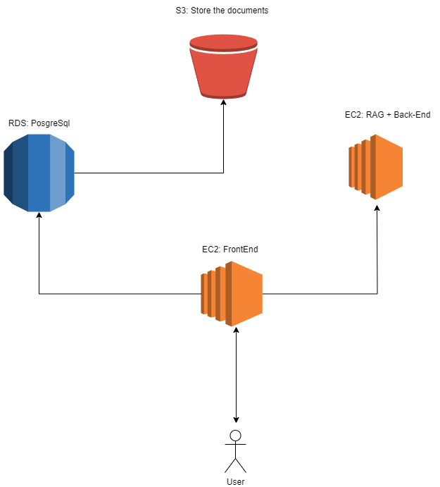

# Clementine-Assistant

Clementine-Assistant is a Q&A application designed to assist developers and data scientists in working with SageMaker. It was developed using the Retrieval Augmented Generation (RAG) technique, which enhances Language Model Models (LLMs) by integrating retrieval mechanisms.

This approach ensures that the content generated by LLMs is both contextually relevant and inherently accurate. RAG serves as a bridge, connecting LLMs to extensive knowledge sources, thereby eliminating the need to train or fine-tune a new LLM model. This significantly reduces the time and cost required to develop this tool.

# Implementation

To implement RAG, we utilized the following components:

1. **Text Loader and Splitter**: We employed Langchain's classes to read the Markdown (md) files and segment them into smaller chunks.

2. **Vector Store**: This component is responsible for storing vectors that represent the text chunks used to assist the Language Model (LLM) in providing accurate answers. In our case, we used PostgreSQL with the PGVector extension for this purpose.

3. **Embedder**: The Embedder is responsible for converting text into vectors. We utilized the *all-MiniLM-L6-v2* model from HuggingFace for this task.

4. **LLM**: We incorporated a pretrained Language Model from HuggingFace, such as *GPT-2* or *Flan-T5*, to be fed with prompts.

5. **Orchestrator**: Langchain is a well-established Python library with numerous integrations that facilitate the creation of LLM applications. Additionally, we implemented a strategy pattern, allowing for easy interchangeability of the LLM and/or the table used for storing embeddings.

# How to run the App Locally?


1. Build a custom postgres image


```
cd src/database
```

```
docker build -t vector-postgres-image .

```

2. Run the container
```bash
docker run -d \
  --name postgres-llm-container \
  -e POSTGRES_DB=llm_aws_docs \
  -e POSTGRES_USER=llmadmin \
  -e POSTGRES_PASSWORD=llmpassword \
  -e POSTGRES_HOST=localhost \
  -e POSTGRES_PORT=5432 \
  -p 5432:5432 \
  vector-postgres-image
```

3. Install all the python libraries needed for the project.

```bash
pip install -r dev_requirements.txt
```

4. Create a table of vectors with the documents in a folder "/path/to/data/".

```bash
python src/database/database.py --env dev --table_name mitabla /path/to/data/
```

5. Run the front-end

```
streamlit run frontend.py
```

# AWS Deployment

In the future, all the components of this app can be easily deployed to AWS. Below is a picture of simple arquitecture, which use Ec2 intances to host the front-end and the RagApp (back-end), an RDS to create a PostgreSql and an S3 to store the documents.



